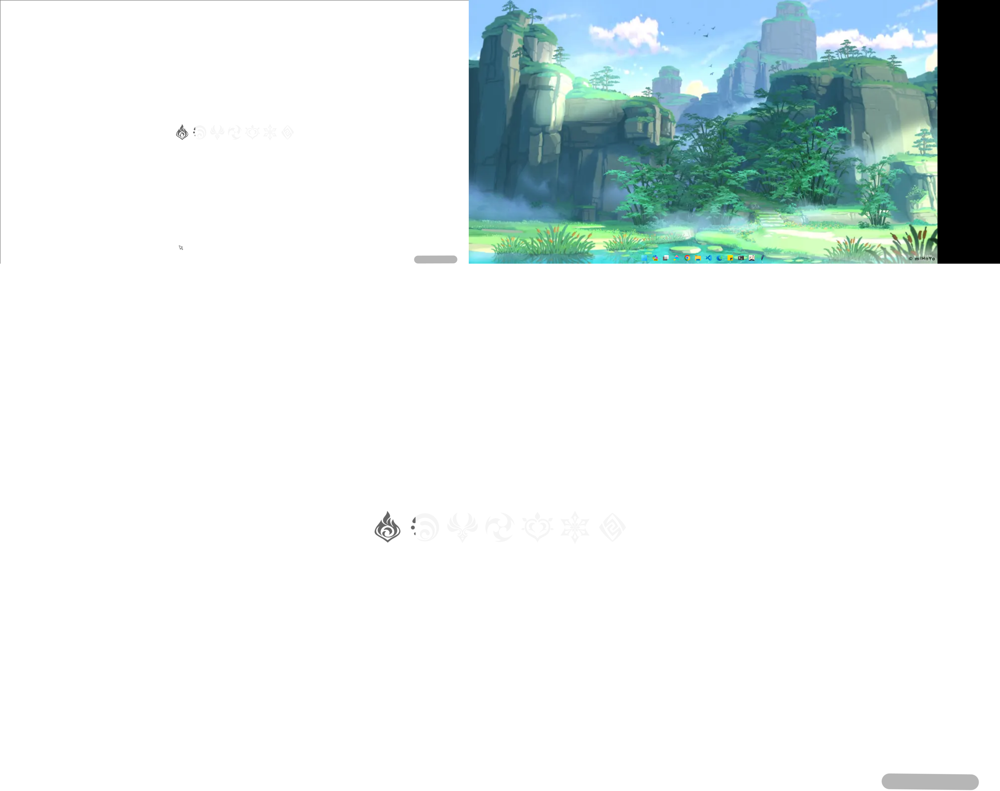

# 扩展屏监看工具

## 目的

可用于4K虚拟屏幕的观看。本项目用于练手，实际上推荐使用OBS

感谢: 4K虚拟屏幕[项目](https://github.com/KtzeAbyss/Easy-Virtual-Display),MSS[项目](https://github.com/BoboTiG/python-mss/tree/main),[调用API获取鼠标样式](https://cloud.tencent.com/developer/ask/sof/106979505)

### OBS使用

OBS延时更低、能进行录制、能很好的捕获鼠标

## 内容

功能：屏幕浏览，可以自调节适应全屏，“沉浸式”屏幕使用，完全的屏幕“复制”

### 环境

使用python 3.10.7编写，在Windows11 23H2运行正常。

### 项目关键

1. 使用MSS捕获屏幕，调用系统底层，延迟低；[项目地址](https://github.com/BoboTiG/python-mss/tree/main)
2. 调用API获取鼠标样式， 感谢[link](https://cloud.tencent.com/developer/ask/sof/106979505)
3. tkinter的动态变化

屏幕捕捉方法不唯一，程序设计也非较优办法。

## 效果展示

4K虚拟屏幕由[Easy-Virtual-Display](https://github.com/KtzeAbyss/Easy-Virtual-Display)帮助

### 多窗口预览

### 单窗口观看

### 	全屏观看（屏幕复制）

### 设置

### 低延时

## 已知问题

[ ] - 有些情况下无法正确显示鼠标样式

[ ] - 延迟；特别是当系统卡顿时  

以上问题不影响基础使用，不考虑修复

[ ] - 显示器数量变化后，预览窗口仍然存在，位置错误，显示范围错误